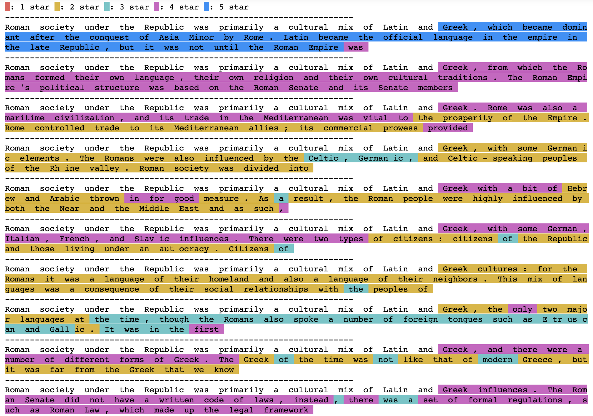

# gpt2reports

Natural Language is a compression system of human knowledge and using that for AI is ultimate way we can understand each other. Natural Language Understanding and having an hash-table like GPT-xx are orthogonal to each other, yet I believe like orthogonal vectors, their combination can go a long way. In this repo, we sstudy the behvaiour of GPT-2 models and perform many experiments trying to validate and explore GPT approach in more detail.

- [Data, Information, Knowledge, and GPT-3](https://medium.com/ontologik/data-information-knowledge-and-gpt-3-5e422107b46b)
- [Are NNs Just Fuzzy Hashtables? A Revealing Experiment on MNIST Data](https://medium.com/ontologik/are-nns-just-fuzzy-hashtables-a-revealing-experiment-on-mnist-data-d5b0c773bf40)

These are our reports on the using GPT2:
- `letters`: asking GPT to get me `n-th` letter of each word after a few examples.
- `sentiment-neuron`: recreating the [unsupervised sentiment neuron experiment](https://openai.com/blog/unsupervised-sentiment-neuron/) from OpenAI

### Sentiment Neuron

If you take a random matrix and encode the hidden representation from GPT-2 XL model to say 5 clusters we get something like this:

While it does generate ideas in the same direction they are all part of different clusters.
