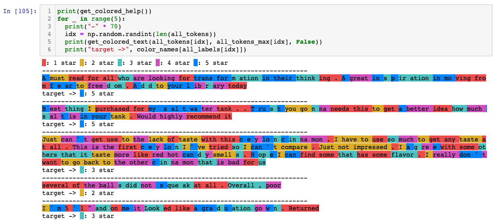
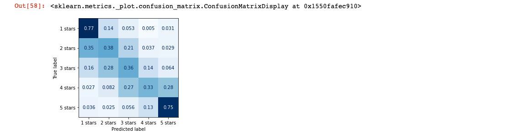
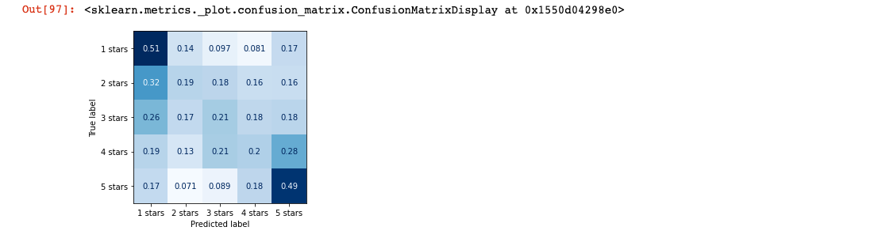

# Sentiment-neuron

In this test we recreate the [unsupervised sentiment neuron experiment](https://openai.com/blog/unsupervised-sentiment-neuron/) from OpenAI. We wanted to see if our results come out the same or not, at this our `full sequence classifier` works better than, `GPT-finetuned classifier`.

- [GPT-Classification-tests](./GPT-Classification-tests.ipynb): This has the code for testing and a cool Visualisation trick.

## Results

### M1: Full Sequence Classifier (CLIP-text-encoder)

### M2: GPT-Finetuned Classifier

